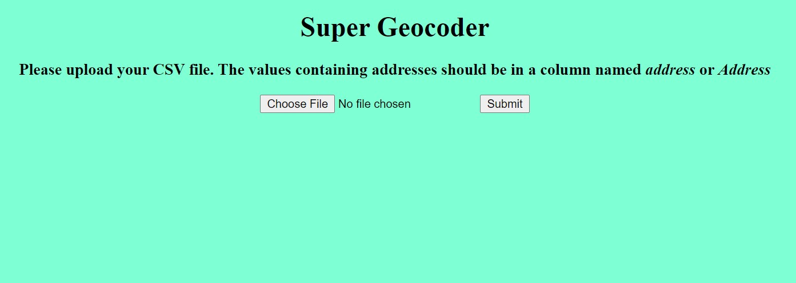
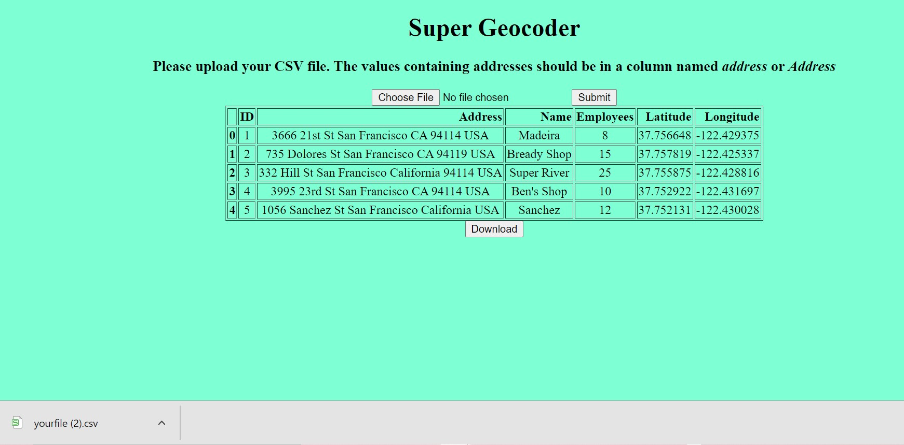
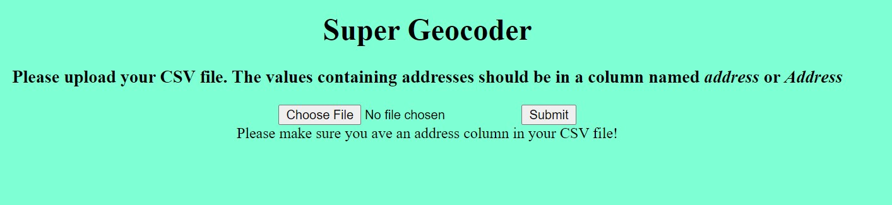
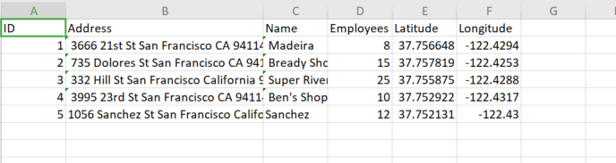

# TABLE OF CONTENT

* [Project description](#project-description)
* [Framework](#framework)
* [Libraries](#libraries)
* [Screenshots](#screenshots)

  

## Project Description

#### Geocoder Web App with Flask and Pandas

This program gets a csv file and calculate longitude and latitude from the “Address”column in the file.

It should be able to:

- calculate longitude and latitude
- display a table with longitude and latitude column
- allow user to download the new table in .csv
- detect csv with no “Address”column
- detect file that is not with .csv extension

## Framework

Flask

## Libraries

- Geopy
- pandas
- datetime

## Screenshots

